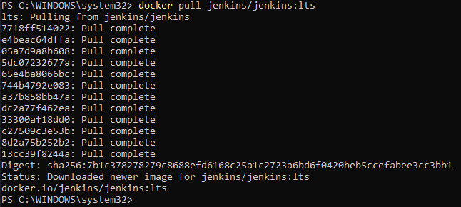
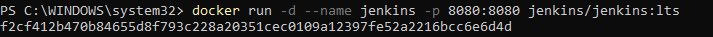
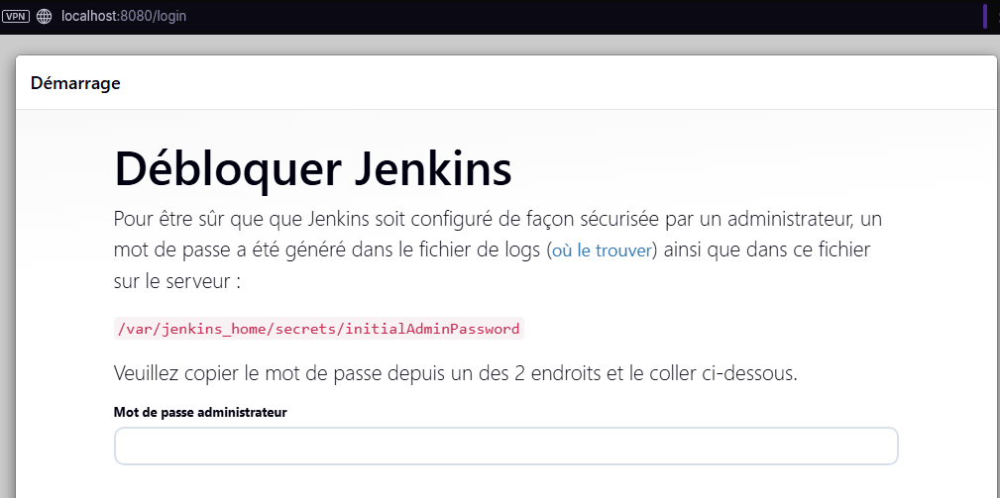
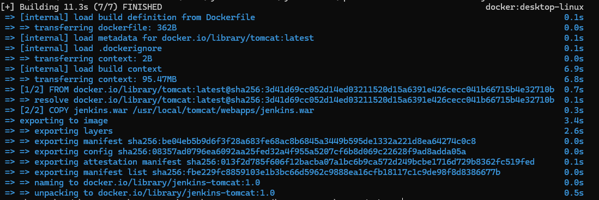
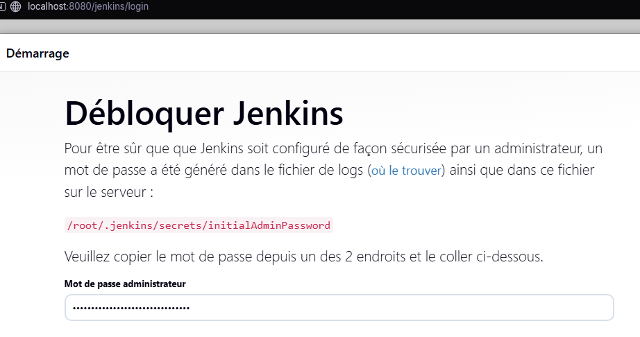

## Commandes utilisées pour le TP03 - Docker

### Partie 1 : Proposer un service

- Installation de Docker Desktop via le site.
- Vérification de l'installation de docker avec `docker --version` puis `docker run hello-world`.

#### 1. Installation de Jenkins 

Via la commande `docker pull jenkins/jenkins:lts`    
jenkins/jenkins : nom de l'image officielle  
lts : version stable

#### 2. Lancement du conteneur.     
`docker run -d --name jenkins -p 8080:8080 jenkins/jenkins:lts`  
-d : lance le conteneur en arrière plan  
--name : nom du conteneur  
-p 8080:8080 : permet de lier le docker à ma machine locale sur le port 8080

#### 3. Jenkins tournes bien et est accessible via le localhost.  

### Partie 2 : Service from scratch

1. Installation de l'image Tomcat : `docker pull tomcat:latest`       
2. Installation du .war via internet 
3. Création du Dockerfile (voir le fichier Dockerfile avec commentaires dedans)
4. Construction de l'image : `docker build -t  jenkins-tomcat:1.0 .`

5. Lancement du service   
Problème rencontré : je n'ai pas arrêté le service précédent.   
Je fais un `docker ps` afin de confirmer mon idée.   
Ensuite, je fais un `docker stop jenkins` pour stopper le conteneur précédent.   
Je refais un `docker run -d -p 8080:8080 jenkins-tomcat:1.0` : l'image est bien lancée.   
